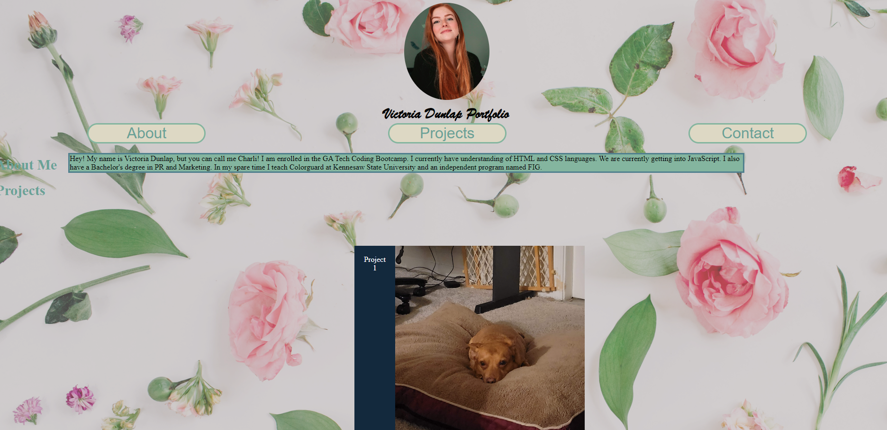
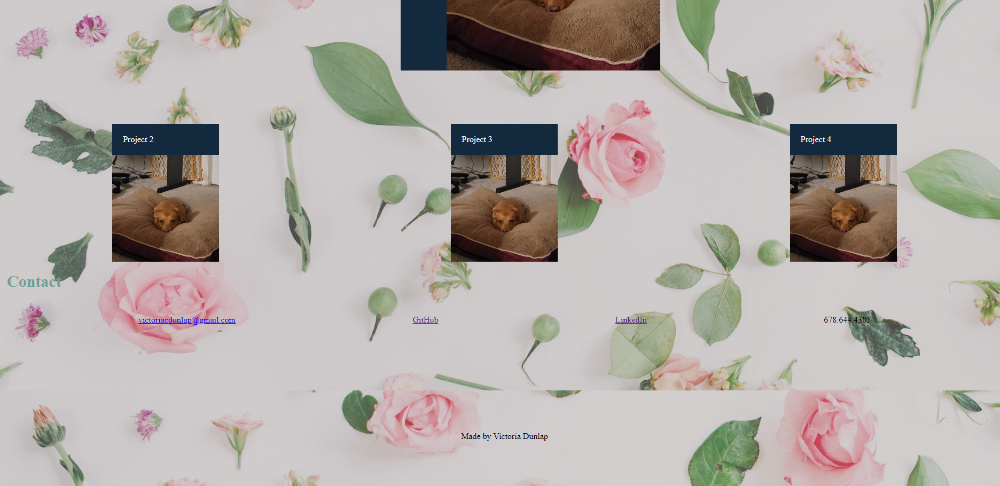

# Victoria_Dunlap_Portfolio

This is my first ever developer portfolio made from scratch! 

I had a lot of fun working on this and felt it helped lock in some concepts we had been learning in class.

## Features include: 

* My name and current picture. 

* An "About Me" section where I briefly introduce myself. 

* A section to features my future projects. Right now it contains placeholders that link to Google.

* Concluding with a Contact section that contains my email, my GitHub page, my LinkedIn page, and my cell phone number. 

I look forward to adding to this and making it even better in the future. 

